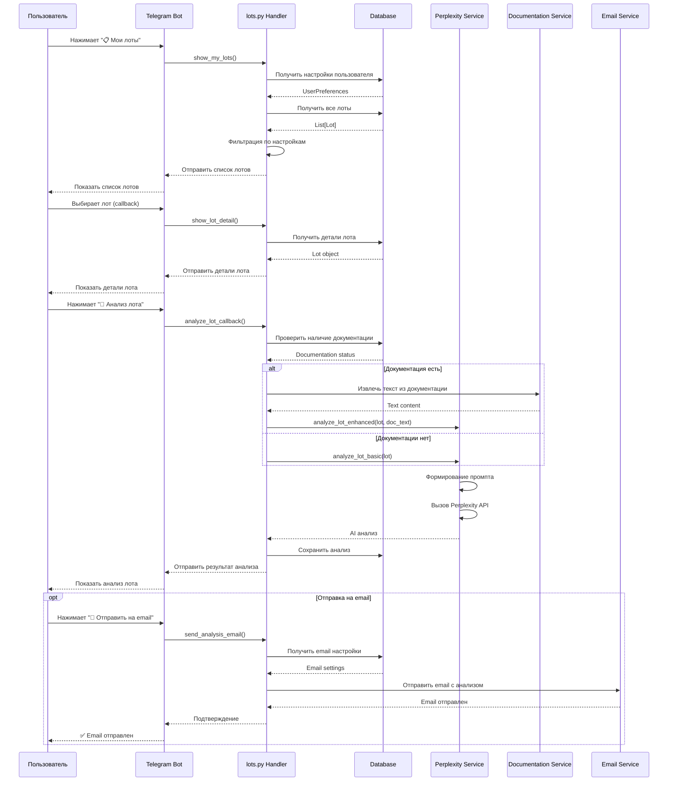
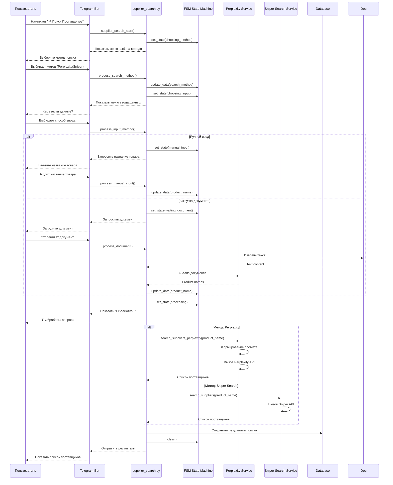
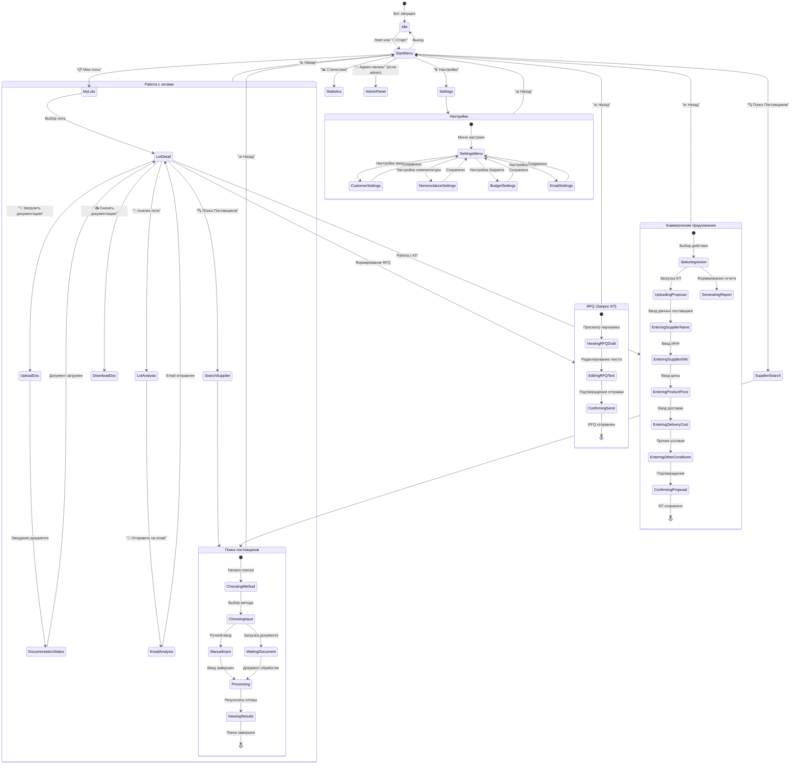
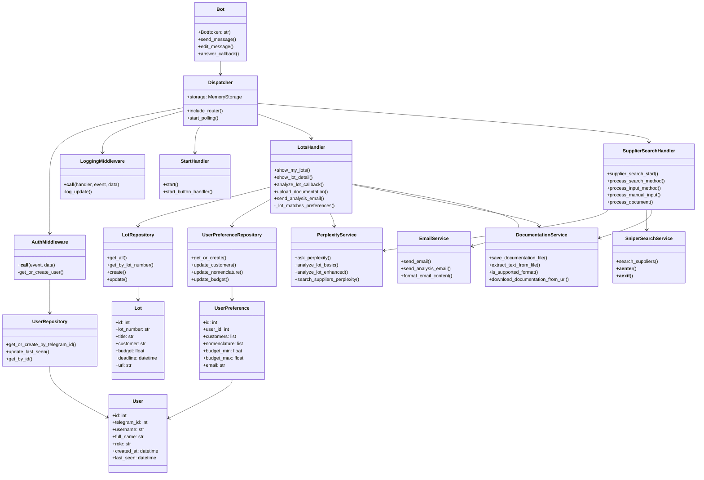
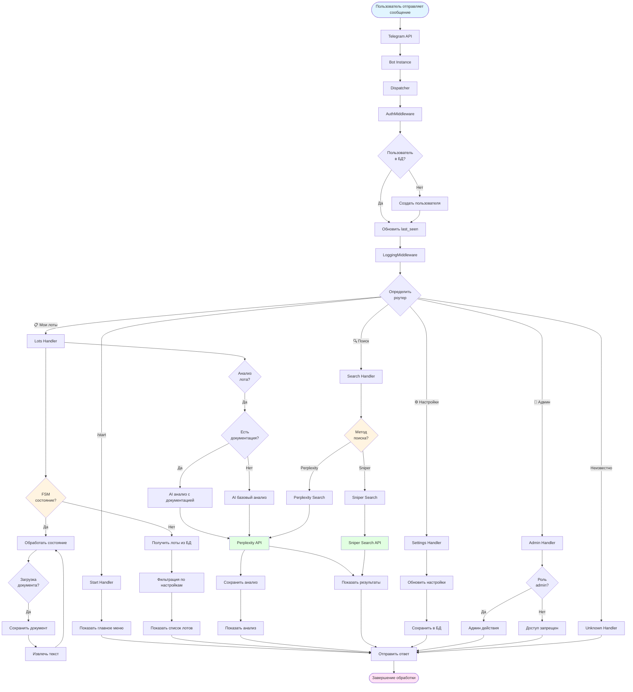
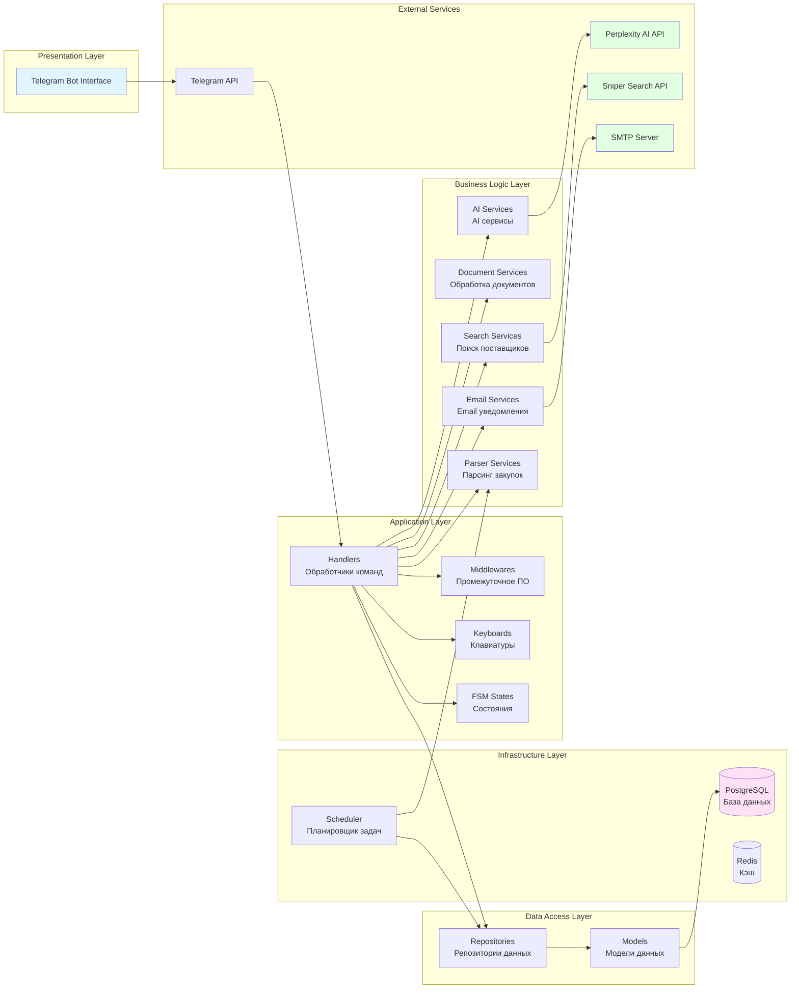
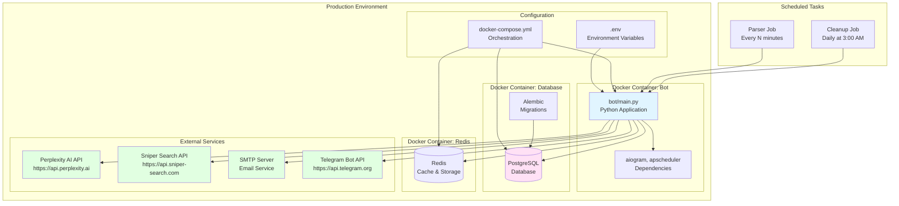

# Диаграммы архитектуры Telegram-бота "Закупки РМКСИБ"

## 1. Архитектурная диаграмма системы

```mermaid
graph TB
    subgraph "Telegram API"
        TG[Telegram Bot API]
    end
    
    subgraph "Bot Application"
        MAIN[bot/main.py<br/>Main Entry Point]
        DP[Dispatcher<br/>FSM Storage]
        
        subgraph "Middlewares"
            AUTH[AuthMiddleware<br/>Проверка доступа]
            LOG[LoggingMiddleware<br/>Логирование]
        end
        
        subgraph "Handlers"
            START[start.py<br/>Старт бота]
            ADMIN[admin.py<br/>Админ панель]
            LOTS[lots.py<br/>Управление лотами]
            SUPPLIERS[suppliers.py<br/>Поставщики]
            SEARCH[supplier_search.py<br/>Поиск поставщиков]
            RFQ[rfq.py<br/>Запросы КП]
            STATS[statistics.py<br/>Статистика]
            SETTINGS[settings.py<br/>Настройки]
            CP[commercial_proposals.py<br/>Коммерческие предложения]
            UNKNOWN[unknown.py<br/>Неизвестные команды]
        end
        
        subgraph "Keyboards"
            REPLY[reply.py<br/>Клавиатуры ответов]
            INLINE[inline.py<br/>Inline кнопки]
        end
        
        subgraph "States"
            FSM[forms.py<br/>FSM состояния]
        end
    end
    
    subgraph "Services Layer"
        subgraph "AI Services"
            PERPLEXITY[perplexity.py<br/>Perplexity AI]
            CP_ANALYSIS[commercial_proposal_analysis.py<br/>Анализ КП]
        end
        
        subgraph "Data Services"
            PARSER[parsers/<br/>Парсинг закупок]
            DOC[documentation/<br/>Обработка документов]
            EMAIL[email/<br/>Email уведомления]
            SEARCH_SVC[search/<br/>Поиск поставщиков]
        end
    end
    
    subgraph "Database Layer"
        DB[(PostgreSQL<br/>База данных)]
        subgraph "Repositories"
            USER_REPO[UserRepository]
            LOT_REPO[LotRepository]
            PREF_REPO[UserPreferenceRepository]
            SUPPLIER_REPO[SupplierRepository]
        end
    end
    
    subgraph "External APIs"
        PERPLEXITY_API[Perplexity API]
        SNIPER_API[Sniper Search API]
        SMTP[SMTP Server]
    end
    
    subgraph "Scheduler"
        SCHED[APScheduler<br/>Периодические задачи]
        PARSE_JOB[Парсинг лотов<br/>Каждые N минут]
        CLEANUP[Очистка истекших лотов<br/>Ежедневно в 3:00]
    end
    
    TG -->|Webhook/Polling| MAIN
    MAIN --> DP
    DP --> AUTH
    AUTH --> LOG
    LOG --> START
    LOG --> ADMIN
    LOG --> LOTS
    LOG --> SUPPLIERS
    LOG --> SEARCH
    LOG --> RFQ
    LOG --> STATS
    LOG --> SETTINGS
    LOG --> CP
    LOG --> UNKNOWN
    
    START --> REPLY
    LOTS --> INLINE
    SEARCH --> INLINE
    RFQ --> INLINE
    
    LOTS --> FSM
    SEARCH --> FSM
    RFQ --> FSM
    
    LOTS --> PERPLEXITY
    LOTS --> DOC
    LOTS --> EMAIL
    SEARCH --> PERPLEXITY
    SEARCH --> SEARCH_SVC
    CP --> CP_ANALYSIS
    
    PERPLEXITY --> PERPLEXITY_API
    SEARCH_SVC --> SNIPER_API
    EMAIL --> SMTP
    
    LOTS --> LOT_REPO
    START --> USER_REPO
    SETTINGS --> PREF_REPO
    SUPPLIERS --> SUPPLIER_REPO
    
    USER_REPO --> DB
    LOT_REPO --> DB
    PREF_REPO --> DB
    SUPPLIER_REPO --> DB
    
    MAIN --> SCHED
    SCHED --> PARSER
    SCHED --> CLEANUP
    PARSER --> LOT_REPO
    
    style MAIN fill:#e1f5ff
    style DP fill:#fff4e1
    style DB fill:#ffe1f5
    style PERPLEXITY_API fill:#e1ffe1
    style SNIPER_API fill:#e1ffe1
    style SMTP fill:#e1ffe1
```

## 2. Диаграмма последовательности: Анализ лота

## 3. Диаграмма последовательности: Поиск поставщиков

## 4. Диаграмма состояний (FSM) бота

## 5. Диаграмма классов основных компонентов

## 6. Диаграмма потока данных: Обработка сообщения пользователя

## 7. Диаграмма компонентов системы

## 8. Диаграмма развертывания

## Описание диаграмм

### 1. Архитектурная диаграмма системы
Показывает общую структуру бота, взаимодействие компонентов, middleware, handlers, services и внешние API.

### 2. Диаграмма последовательности: Анализ лота
Детализирует процесс анализа лота от запроса пользователя до получения результата и отправки на email.

### 3. Диаграмма последовательности: Поиск поставщиков
Показывает полный цикл поиска поставщиков с использованием FSM состояний и различных методов поиска.

### 4. Диаграмма состояний (FSM)
Визуализирует все возможные состояния бота и переходы между ними при работе с различными функциями.

### 5. Диаграмма классов
Отображает основные классы системы, их методы и взаимосвязи между компонентами.

### 6. Диаграмма потока данных
Показывает поток обработки сообщения пользователя от получения до отправки ответа.

### 7. Диаграмма компонентов системы
Демонстрирует слоистую архитектуру приложения с разделением на Presentation, Application, Business Logic, Data Access и Infrastructure слои.

### 8. Диаграмма развертывания
Показывает инфраструктуру развертывания бота в Docker контейнерах и взаимодействие с внешними сервисами.

